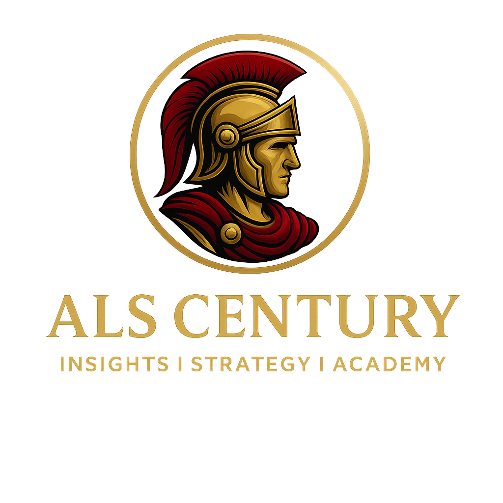

## 🧠 ALS Century Dashboard

Dashboard interativo desenvolvido com **Python + Streamlit** para monitoramento de indicadores de mercado voltados à análise do **Dólar Futuro**.



---

### 📊 Funcionalidades

- Visualização dinâmica dos principais indicadores
- Atualização manual via botão de recarregamento
- Interface simplificada e responsiva
- Foco na performance e leitura rápida de dados

---

### 🚀 Como rodar localmente

Clone o repositório:

```bash
git clone https://github.com/alscentury/als-century-dashboard.git
cd als-century-dashboard
```

Instale as dependências:

```bash
pip install -r requirements.txt
```

Inicie o app com Streamlit:

```bash
streamlit run monitor_indicadores_dolfut.py
```

---

### 🧪 Requisitos

Veja os pacotes usados em `requirements.txt`, incluindo:

- streamlit
- pandas
- plotly
- requests
- matplotlib

---

### 📸 Interface

Aqui você pode inserir um print do dashboard ou linkar imagens:

```markdown

```

---

### 👤 Autor

Projeto desenvolvido por **Andre [@alscentury]**  
💌 alscentury@gmail.com  
📍 Curitiba, PR

---

### 📄 Licença

Este projeto está sob a licença MIT – veja o arquivo LICENSE para detalhes.

---

